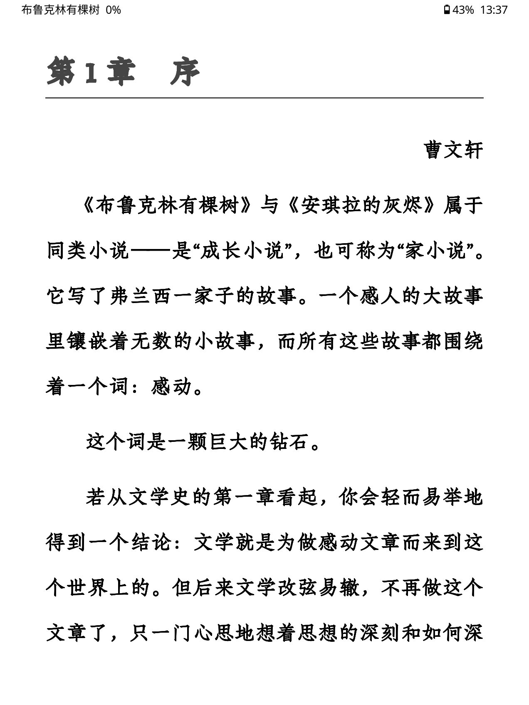
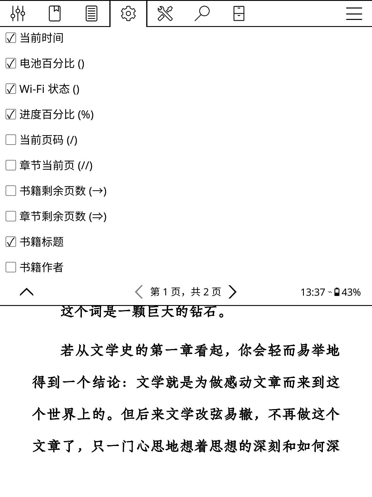
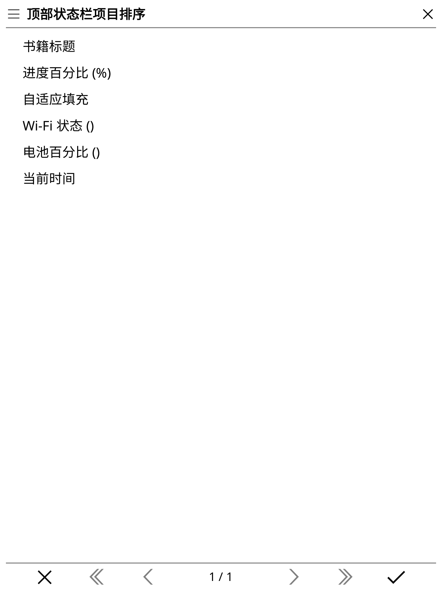
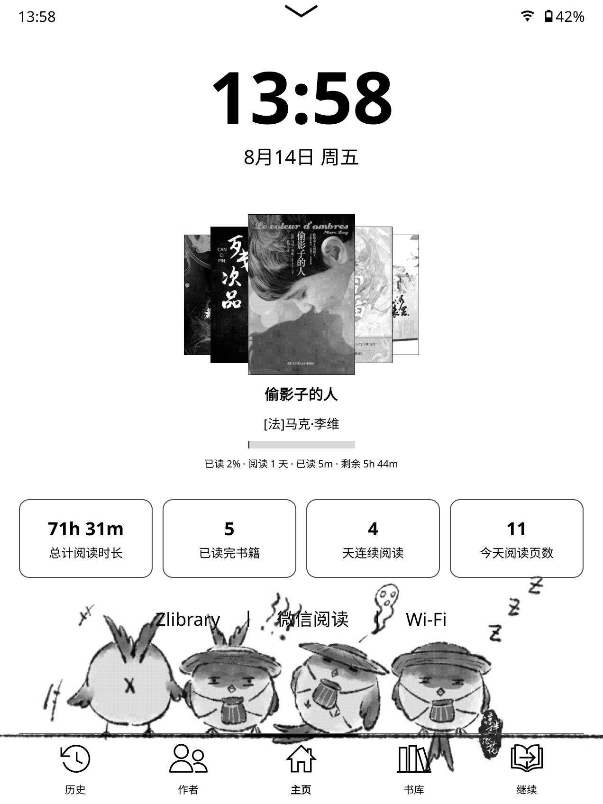
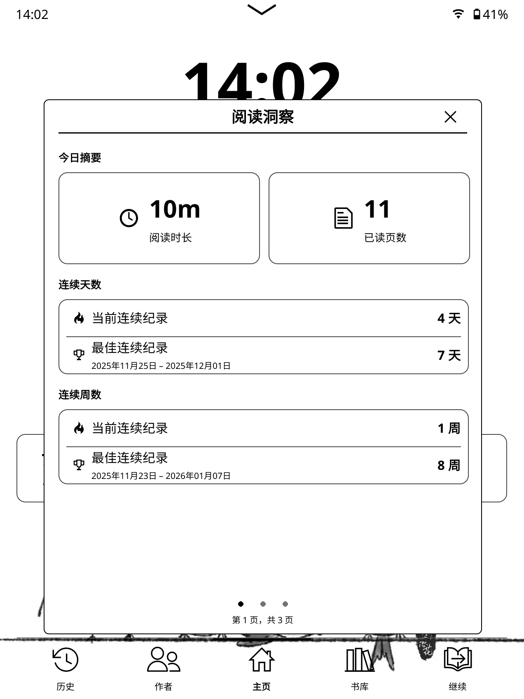
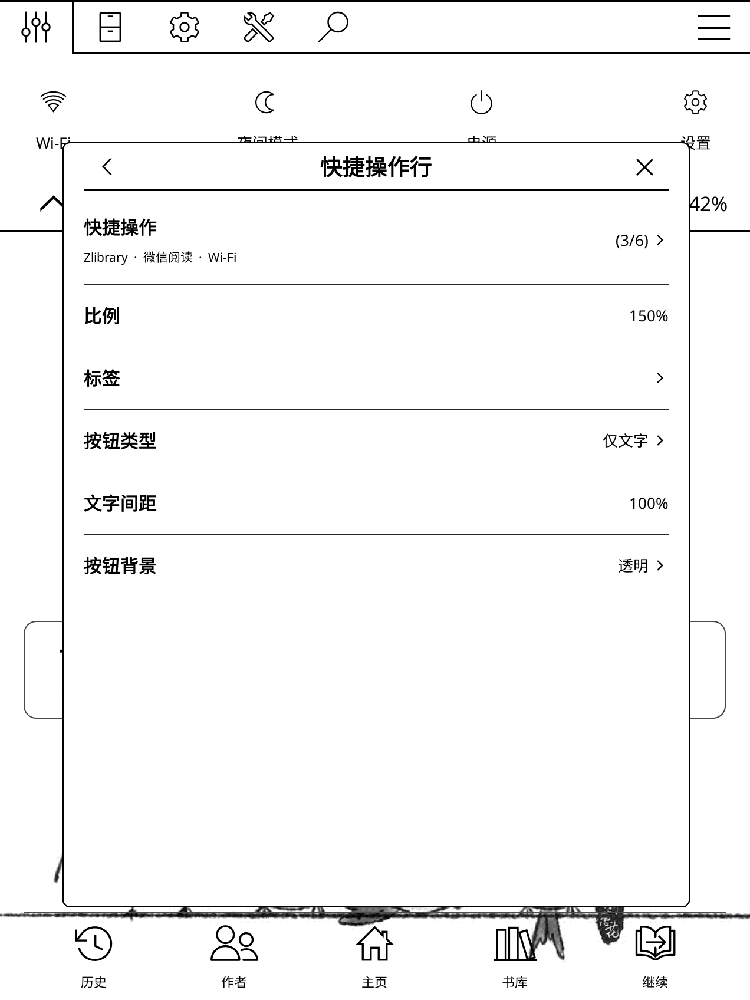
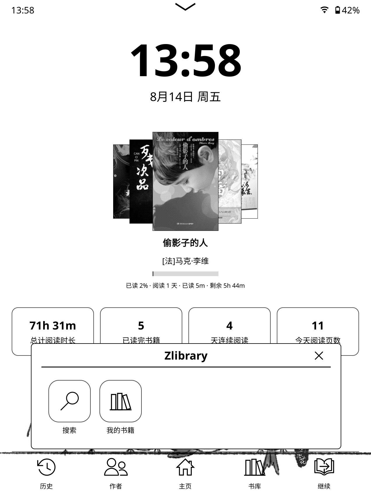
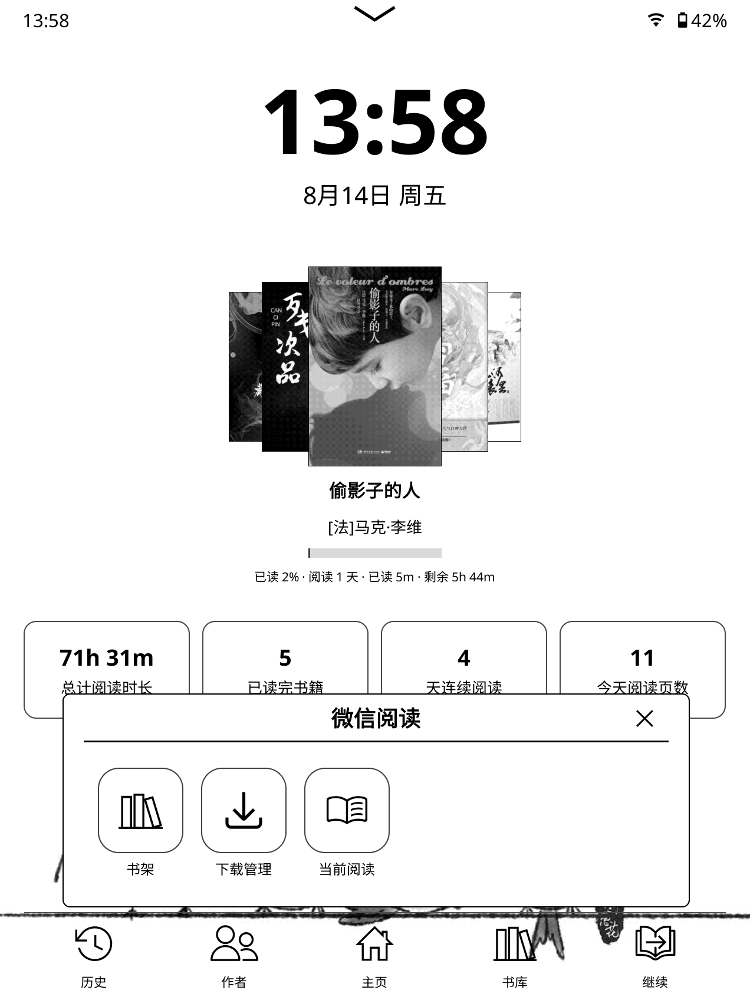
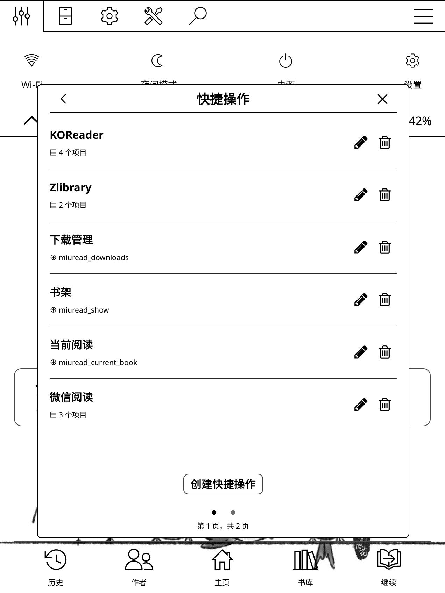
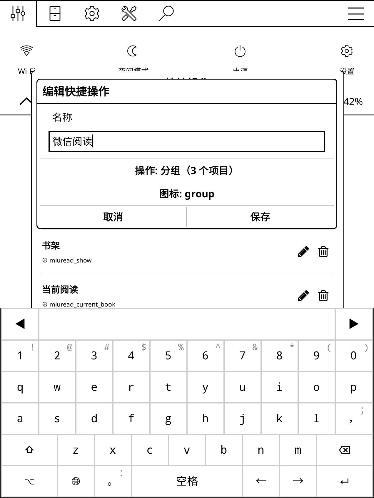

# English

## Some personalized patches and plugins

### How to use

1. download the patch file with .lua extension
2. add this file to the directory /mnt/us/koreader/patches, if there is no such a directory, create it.
3. reboot koreader
4. Enjoy!

### Guard
This tool is used by patches that require a minimum KOReader version to work, and it prevents them from crashing if the requirement isn't met.

### patches/2-custom-header
This file is for customing the header for your KOReader following the native footer style, particularly for En/Zh language.

You can select the items you want to display and sort them in the order you want.

It's better to disable the native header when you use this custom header.
NOTE: disable all items of native footer if you hope to hide it completely.

If you want to apply it for other languages, just modify 'CUSTOM_TRANSLATIONS'.

### plugins/simpleui.koplugin
Modified some files with .lua extension and zh_CN.po to improve the localization
for Chinese and English particularly for dates displayed in homepage and reading records.

Also add "Text only" button for quickActionRow. You can personalize the button using text without an icon.

# Chinese

## 一些个性化的补丁和插件

### 使用方法

1. 下载带有 `.lua` 扩展名的补丁文件。
2. 将该文件放入 `/mnt/us/koreader/patches` 目录。如果该目录不存在，请手动创建。
3. 重启 KOReader。
4. 享受吧！

### Guard

此工具用于需要最低 KOReader 版本才能正常工作的补丁，可以防止在版本要求不满足时导致 KOReader 崩溃。

### patches/2-custom-header

此文件用于为 KOReader 自定义顶部状态栏，使其遵循原生底部状态栏的样式，尤其针对中英文语言环境进行了优化。

你可以选择希望显示的项目，并按照自己的需求对它们进行排序。

使用此自定义顶部状态栏时，建议禁用原生顶部状态栏。

注意：如果希望完全隐藏原生底部状态栏，请禁用原生底部状态栏中的所有项目。

如果希望将其应用于其他语言，只需修改 `CUSTOM_TRANSLATIONS` 即可。

### plugins/simpleui.koplugin

修改了一些 `.lua` 文件和 `zh_CN.po` 文件，以改善中文和英文环境下的本地化效果，尤其是主页和阅读记录中显示的日期。

此外，还为 `quickActionRow` 添加了“纯文字”按钮。你可以使用文字而不是图标来自定义该按钮。

